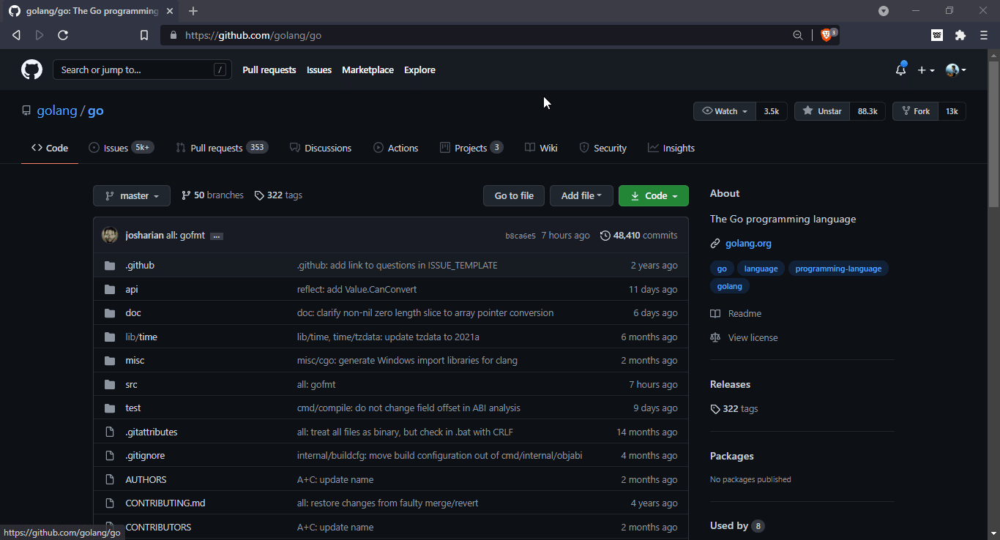

# DOCGO!

I made if for fun and it might help you. Enjoy!

## How to use it

1. Add the extension from [chrome web store](https://chrome.google.com/webstore/detail/docgo/jllcbbemppedmpfjjeaoifdogcinmjpm) to your browser.

2. Head over to any Go package/module ex. [The Go repository](https://github.com/golang/go).

3. Click on the extension and Go!

   

**Pro tip:** You can pin the extension.

## Why

Sometimes, Go developers fail to mention official documentation URL for their repository. We have to manually go to [pkg.go.dev](pkg.go.dev) and search for that repository. This extension helps to go to the documentation right from where you are.

## Contributing

If you have any idea, feel free to open an issue.

## Thank You!

If you like it, please rate it on chrome store and keep coding!
